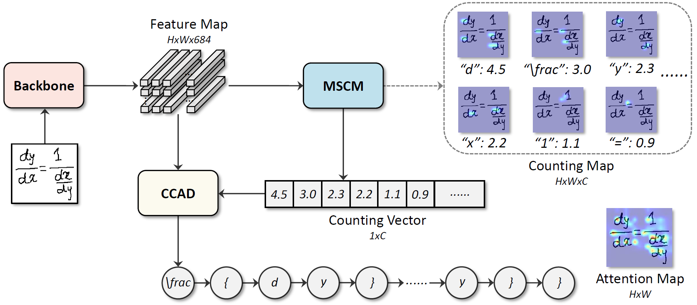
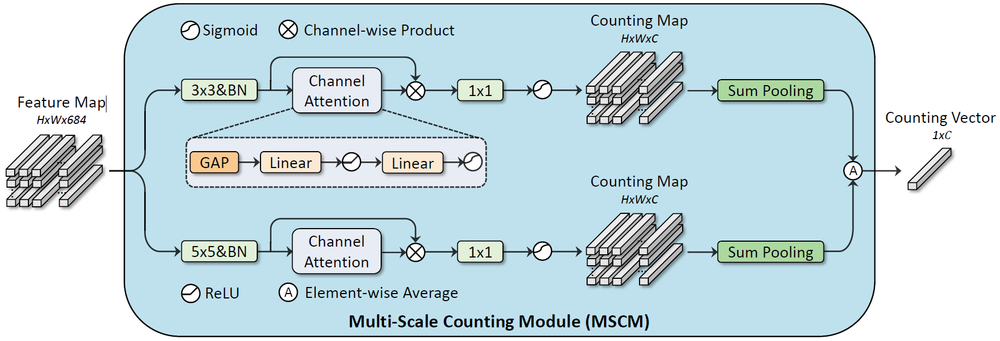

# When Counting Meets HMER: Counting-Aware Network for Handwritten Mathematical Expression Recognition

This is the official pytorch implementation of [CAN](https://arxiv.org/abs/2207.11463) (ECCV'2022). 

>*Bohan Li, Ye Yuan, Dingkang Liang, Xiao Liu, Zhilong Ji, Jinfeng Bai, Wenyu Liu, Xiang Bai*

## Abstract

<p align="justify">
Recently, most handwritten mathematical expression recognition (HMER) methods adopt the encoder-decoder networks, which directly predict the markup sequences from formula images with the attention mechanism. However, such methods may fail to accurately read formulas with complicated structure or generate long markup sequences, as the attention results are often inaccurate due to the large variance of writing styles or spatial layouts. To alleviate this problem, we propose an unconventional network for HMER named Counting-Aware Network (CAN), which jointly optimizes two tasks: HMER and symbol counting. Specifically, we design a weakly-supervised counting module that can predict the number of each symbol class without the symbol-level position annotations, and then plug it into a typical attention-based encoder-decoder model for HMER. Experiments on the benchmark datasets for HMER validate that both joint optimization and counting results are beneficial for correcting the prediction errors of encoder-decoder models, and CAN consistently outperforms the state-of-the-art methods. In particular, compared with an encoder-decoder model for HMER, the extra time cost caused by the proposed counting module is marginal. 
</p>

## Pipeline

<p align="left"></p>

## Counting Module

<p align="left"></p>

## Datasets

Download the CROHME dataset from [BaiduYun](https://pan.baidu.com/s/1qUVQLZh5aPT6d7-m6il6Rg) (downloading code: 1234) and put it in ```datasets/```.

The HME100K dataset can be download from the official website [HME100K](https://ai.100tal.com/dataset).

## Training

Check the config file ```config.yaml``` and train with the CROHME dataset:

```
python train.py --dataset CROHME
```

By default the ```batch size``` is set to 8 and you may need to use a GPU with 32GB RAM to train your model. 

## Testing

Fill in the ```checkpoint``` (pretrained model path) in the config file ```config.yaml``` and test with the CROHME dataset:

```
python inference.py --dataset CROHME
```

Note that the testing dataset path is set in the ```inference.py```.

## Citation

```
@inproceedings{CAN,
  title={When Counting Meets HMER: Counting-Aware Network for Handwritten Mathematical Expression Recognition},
  author={Li, Bohan and Yuan, Ye and Liang, Dingkang and Liu, Xiao and Ji, Zhilong and Bai, Jinfeng and Liu, Wenyu and Bai, Xiang},
  booktitle={Proceedings of the European Conference on Computer Vision (ECCV)},
  pages={197--214},
  year={2022}
}
```

## Recommendation

Some other excellent open-sourced HMER algorithms can be found here:

[WAP](https://github.com/JianshuZhang/WAP)[PR'2017]
[DWAP-TD](https://github.com/JianshuZhang/TreeDecoder)[ICML'2020]
[BTTR](https://github.com/Green-Wood/BTTR)[ICDAR'2021]
[ABM](https://github.com/XH-B/ABM)[AAAI'2022]
[SAN](https://github.com/tal-tech/SAN)[CVPR'2022]
[CoMER](https://github.com/Green-Wood/CoMER)[ECCV'2022]


